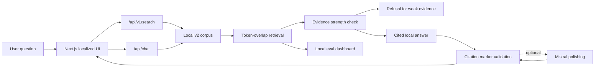

# YachayBot v2

> Evidence-first AI search for public Peruvian cultural and educational resources.

[](https://nextjs.org/)
[](https://www.typescriptlang.org/)
[](#validation)
[](#ai-and-retrieval-design)
[](#limitations)

YachayBot began as a chatbot project that placed third at the INFORTELGRAF Peru Hackathon 2025. This v2 rebuild turns the original idea into a scoped full-stack AI search prototype: users search a curated corpus, inspect source cards, ask grounded questions, see citations, and get refusals when indexed evidence is too weak.

For a SWE and AI portfolio, the project is meant to show product judgment and engineering discipline: typed API contracts, source-grounded generation, citation validation, retrieval evaluation, browser-tested flows, and clear boundaries around what is demo-grade versus future work.


## Table Of Contents

- [Highlights](#highlights)
- [Try The MVP](#try-the-mvp)
- [Architecture](#architecture)
- [AI And Retrieval Design](#ai-and-retrieval-design)
- [Corpus, Data, And Evaluation](#corpus-data-and-evaluation)
- [Quick Start](#quick-start)
- [API Overview](#api-overview)
- [Project Structure](#project-structure)
- [Validation](#validation)
- [Limitations](#limitations)
- [Roadmap](#roadmap)

## Highlights

- Search-first Next.js interface for public Peruvian cultural and educational resources.
- Evidence-grounded answer generation with citation markers and refusal behavior.
- Optional Mistral polishing only after deterministic retrieval produces usable evidence.
- Citation safety check that rejects model output if citation markers are missing or invented.
- Local deterministic retrieval baseline with transparent scoring and reproducible tests.
- Eval dashboard for top-3 hit rate, top-5 hit rate, refusal pass rate, and latency.
- Paused auth and educator workspace routes, avoiding half-working protected flows.
- Playwright-smoked public flows for search, sources, chat, evals, paused dashboard, mobile navigation, and API contracts.

## Try The MVP

The public demo surface is localized and search-first:

| Route | Purpose |
| --- | --- |
| `/es` | Spanish search experience |
| `/qu` | Quechua-locale search shell with experimental/source-bound behavior |
| `/ay` | Aymara-locale search shell with experimental/source-bound behavior |
| `/es/sources` | Source browser with language, topic, and source-type filters |
| `/es/evals` | Local retrieval/refusal evaluation dashboard |
| `/es/ai-bot` | Chat UI over the same retrieval, citation, and refusal rules |

Legacy account routes are intentionally paused:

| Route | Current behavior |
| --- | --- |
| `/sign-in` | Explains that auth is out of scope for this MVP |
| `/dashboard` | Shows a paused educator-workspace state |
| `/api/auth/*` | Returns `503 FEATURE_UNAVAILABLE` |

## Architecture



Important implementation files:

- `src/app/[locale]/page.tsx`: localized search-first homepage
- `src/app/[locale]/sources/page.tsx`: source browser
- `src/app/[locale]/evals/page.tsx`: eval dashboard
- `src/app/[locale]/ai-bot/page.tsx`: chat UI
- `src/app/api/v1/*`: v2 API routes
- `src/app/api/chat/route.ts`: evidence-first chat endpoint
- `src/lib/v2-data.ts`: local corpus, retrieval, answers, and evals
- `src/lib/v2-schemas.ts`: Zod request validation schemas
- `src/lib/v2-types.ts`: shared TypeScript contracts
- `migrations/001_v2_core.sql`: target Postgres/pgvector schema draft
- `docs/adr/*`: architecture decision records

## AI And Retrieval Design

The current MVP uses deterministic local data so reviewers can inspect behavior without provider keys, hosted databases, or hidden model calls.

1. A user submits a query from search or chat.
2. API routes validate input with Zod.
3. `searchCorpus` ranks local chunks with token-overlap scoring.
4. `buildAnswer` classifies evidence as strong, moderate, or weak.
5. Weak evidence returns a refusal instead of a confident answer.
6. Usable evidence returns a cited local answer.
7. If `MISTRAL_API_KEY` is configured, Mistral may polish the answer.
8. Polished output is accepted only if it preserves known citation markers.

### RAG / Model Card

| Area | Current implementation |
| --- | --- |
| Intended use | Discover and inspect public Peruvian cultural and educational resources |
| Retrieval source | Local TypeScript corpus in `src/lib/v2-data.ts` |
| Retrieval method | Deterministic token-overlap baseline |
| Generation | Local template-based grounded answer; optional Mistral polishing |
| Guardrails | Zod validation, evidence-strength refusal, citation marker validation, rate limiting |
| Citations | Answers cite retrieved chunk markers such as `[1]` |
| Unsupported requests | Refused when indexed evidence is weak or absent |
| Current stage | MVP prototype, not production deployment |
| Future path | Postgres/pgvector schema draft and optional Pinecone migration |

## Corpus, Data, And Evaluation

The MVP corpus contains:

- 15 public or official source records
- 5 curated methodology notes
- 1 inspectable chunk per source record
- metadata for institution, language, region, topic tags, rights notes, and source URL

The local eval set contains 10 questions:

- factual retrieval checks with expected source IDs
- refusal checks for unsupported or unsafe requests
- metrics for top-3 hit rate, top-5 hit rate, refusal pass rate, and average latency

Current deterministic local eval metrics:

| Metric | Value |
| --- | ---: |
| Top-3 hit rate | 1.00 |
| Top-5 hit rate | 1.00 |
| Refusal pass rate | 1.00 |

These metrics are useful for regression testing the MVP corpus. They are not a production accuracy claim.

## Screenshots

| Search | Sources | Evals |
| --- | --- | --- |
|  |  |  |

## Tech Stack

| Layer | Tools |
| --- | --- |
| Frontend | Next.js, React, TypeScript, Tailwind CSS, next-intl |
| API | Next.js route handlers |
| Validation | Zod |
| Retrieval | Local TypeScript corpus, deterministic token-overlap scoring |
| AI | Optional Mistral polishing after retrieval and citation checks |
| Database path | Supabase Postgres and pgvector migration draft |
| Future vector path | Optional Pinecone migration |
| Testing | TypeScript unit tests, Next.js build checks, Playwright smoke testing |

## Quick Start

Install dependencies:

```bash
npm install
```

Generate the Prisma client:

```bash
npm run prisma-generate
```

Start the app:

```bash
npm run dev
```

Open:

```text
http://localhost:3000/es
```

If port 3000 is busy:

```bash
npm run dev -- -p 3001
```

## Configuration

Create a local environment file:

```bash
copy .env.example .env.local
```

Optional variables:

| Variable | Current role |
| --- | --- |
| `MISTRAL_API_KEY` | Enables optional answer polishing after source-grounded retrieval |
| `PINECONE_API_KEY` | Reserved for future vector-search migration |
| `PINECONE_HOST` | Reserved for future vector-search migration |

The deterministic MVP works without Mistral or Pinecone credentials.

## API Overview

### `GET /api/v1/documents`

Returns source records and inspectable chunks.

### `POST /api/v1/search`

Searches the local corpus and returns ranked chunks, source metadata, latency, detected language, evidence strength, and an answer preview.

```json
{
  "query": "Que recursos explican educacion intercultural bilingue?",
  "limit": 5
}
```

### `POST /api/v1/answers`

Generates an answer from reviewed chunks only. If evidence is weak, the API refuses.

```json
{
  "query": "Que recursos explican educacion intercultural bilingue?",
  "chunkIds": ["chunk-doc-minedu-eib-001"]
}
```

### `GET /api/v1/evals/runs`

Returns the deterministic local eval run and metrics.

### `POST /api/chat`

Validates chat messages, retrieves from the v2 corpus, builds a cited answer or refusal, and optionally calls Mistral for grounded answer polishing.

## Project Structure

```text
.
├── src/
│   ├── app/                 # Localized pages and API routes
│   ├── components/          # UI components and v2 search experience
│   ├── i18n/                # next-intl routing and request config
│   └── lib/                 # v2 corpus, retrieval, schemas, tests, types
├── docs/                    # Architecture, methodology, limitations, ADRs
├── public/demo/             # Committed demo SVGs for review
├── migrations/              # v2 Postgres/pgvector schema draft
├── data/                    # Curated data notes and source metadata placeholder
├── evals/                   # Evaluation notes
├── api/                     # Future FastAPI service boundary notes
├── web/                     # Frontend boundary notes
└── prisma/                  # Existing Prisma setup kept for future workspace work
```

## Validation

Run the main local checks:

```bash
npm run lint
npx tsc --noEmit
npm test
npm run build
```

Recent validation has covered:

- 20 TypeScript tests
- invalid API payloads
- search and answer behavior
- Mistral citation acceptance/rejection
- paused auth routes
- eval run API behavior
- chat rate limiting
- retrieval/refusal eval metrics
- production Next.js build

The historical slash-command validation contract also calls `bun run lint`, `bunx tsc --noEmit`, and `bun test`; those require Bun to be installed.

## Documentation

- [Architecture](docs/architecture.md)
- [Methodology](docs/methodology.md)
- [Limitations](docs/limitations.md)
- [Demo script](docs/demo-script.md)
- [Portfolio summary](docs/portfolio-summary.md)
- [PRD](.github/PRDs/PRD.md)
- [ADR 0001: FastAPI boundary](docs/adr/0001-use-fastapi-for-ai-search-service.md)
- [ADR 0002: Supabase Postgres and pgvector](docs/adr/0002-use-supabase-postgres-with-pgvector.md)
- [ADR 0003: Search-first UI](docs/adr/0003-use-search-first-ui.md)
- [ADR 0004: Source-grounded generation](docs/adr/0004-use-source-grounded-generation.md)

## What Changed From The Hackathon Demo

The first version described a broad multilingual chatbot, semantic search stack, and full authentication surface. The v2 project is intentionally narrower:

- From broad chatbot claims to source-grounded search and cited answers
- From hidden AI behavior to inspectable retrieval, evidence strength, and refusals
- From implied vector search to an explicit deterministic MVP baseline
- From active auth claims to paused auth until there is a protected workflow worth securing
- From general multilingual claims to explicit Spanish/English behavior and experimental Quechua/Aymara boundaries

## Limitations

- The corpus is small and curated for demonstration.
- Local retrieval uses token overlap, not production vector search.
- Quechua and Aymara behavior is experimental and source-bound.
- Curated notes are methodology notes, not primary cultural sources.
- Sign-in and educator workspace flows are paused.
- Rate limiting is an in-memory MVP guard, not a production Redis or KV limiter.
- The project does not claim community validation.
- The project does not claim zero hallucinations.
- The project does not claim to preserve ancestral knowledge by itself.
- No license file is currently included.

## Roadmap

- Move retrieval storage from the local corpus to Postgres/pgvector.
- Add a real ingestion pipeline for source documents and chunking.
- Add persistent eval artifacts and regression history.
- Decide whether Pinecone is needed after pgvector baseline testing.
- Reintroduce auth only when a protected educator workflow is implemented.
- Expand multilingual behavior only with source coverage and evaluation.

## Repository Topics

Suggested GitHub topics:

`ai-search`, `evidence-first`, `rag`, `retrieval-augmented-generation`, `source-grounded`, `citations`, `peru`, `education`, `cultural-heritage`, `multilingual`, `nextjs`, `typescript`, `tailwindcss`, `zod`, `mistral-ai`, `evals`, `playwright`, `postgresql`, `pgvector`, `open-source`

## Origin And Acknowledgements

YachayBot began at INFORTELGRAF Peru Hackathon 2025, where it placed third. This v2 rebuild keeps the educational motivation while making the system's evidence, architecture, and limitations inspectable.

Thank you to Alberth Jesus Vigo Saldana and Pierina Ramos for supporting innovation in Peruvian tech, and to Jeff Barr, Lesly Zerna, Melissa Amado, Narciso Lema, Lennin Cenas Vasquez, and Nicolas Molina Monroy for openly sharing knowledge that inspires this work.
