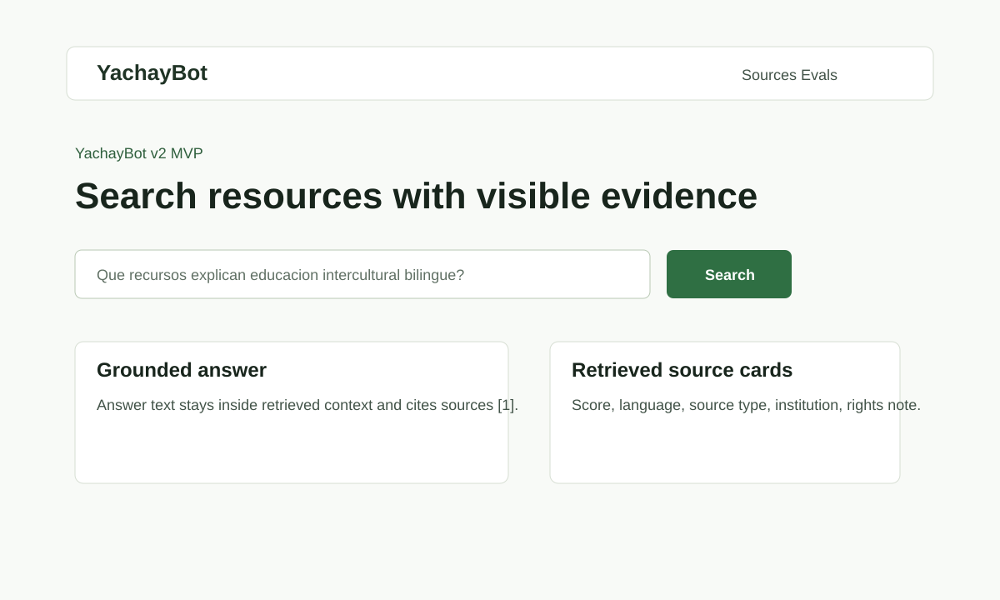
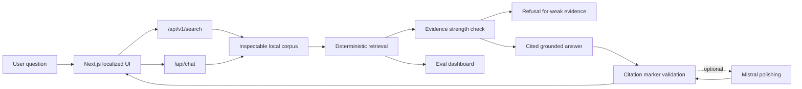
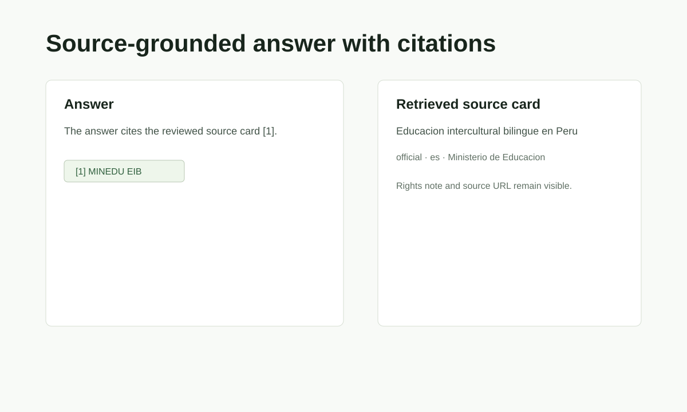
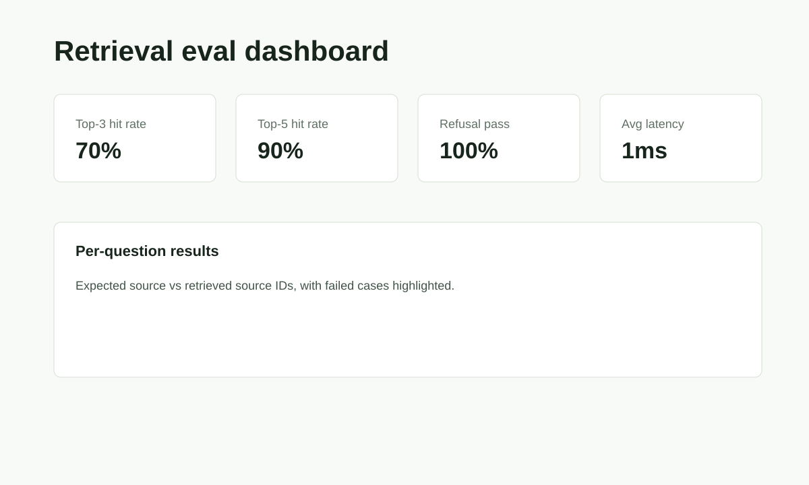

# YachayBot

> Source-grounded AI search for public Peruvian cultural and educational knowledge.

[](https://nextjs.org/)
[](https://www.typescriptlang.org/)
[](#validation)
[](#ai-system-design)
[](#project-scope)

YachayBot is a full-stack AI search application for exploring public Peruvian cultural and educational resources. It combines a localized Next.js interface, typed API routes, deterministic retrieval, citation-aware answer generation, refusal behavior for weak evidence, and a lightweight evaluation dashboard.

Built as a completed SWE + AI portfolio project, YachayBot demonstrates the engineering judgment expected in production-minded AI systems: clear API contracts, explicit retrieval behavior, model-output validation, reproducible tests, scoped product decisions, and transparent limitations.



## Table Of Contents

- [Highlights](#highlights)
- [Product Surface](#product-surface)
- [Architecture](#architecture)
- [AI System Design](#ai-system-design)
- [Corpus And Evaluation](#corpus-and-evaluation)
- [Screenshots](#screenshots)
- [Tech Stack](#tech-stack)
- [Quick Start](#quick-start)
- [API Overview](#api-overview)
- [Project Structure](#project-structure)
- [Validation](#validation)
- [Project Scope](#project-scope)

## Highlights

- Search-first interface for public Peruvian cultural and educational resources.
- Localized routes for Spanish, Quechua, and Aymara user journeys.
- Source cards with snippets, language, institution, region, topic tags, rights notes, and URLs.
- Evidence-grounded answer generation with citation markers.
- Refusal behavior when indexed evidence is weak or absent.
- Optional Mistral polishing after deterministic retrieval succeeds.
- Citation safety check that rejects model output if markers are missing or invented.
- Evaluation dashboard for top-3 hit rate, top-5 hit rate, refusal pass rate, and latency.
- Typed API contracts with Zod validation and TypeScript tests.
- Browser-smoked public flows covering search, sources, chat, evals, mobile navigation, and API contracts.

## Product Surface

| Route | Purpose |
| --- | --- |
| `/es` | Spanish search experience |
| `/qu` | Quechua-locale search shell with source-bound behavior |
| `/ay` | Aymara-locale search shell with source-bound behavior |
| `/es/sources` | Source browser with language, topic, and source-type filters |
| `/es/evals` | Retrieval and refusal evaluation dashboard |
| `/es/ai-bot` | Chat UI over the same retrieval, citation, and refusal rules |

Account and educator workspace routes are intentionally scoped out of the public build:

| Route | Current behavior |
| --- | --- |
| `/sign-in` | Shows an auth-out-of-scope page |
| `/dashboard` | Shows an educator-workspace scope page |
| `/api/auth/*` | Returns `503 FEATURE_UNAVAILABLE` |

This keeps the project focused on the AI search system rather than presenting unfinished authentication as a feature.

## Architecture



Important implementation files:

- `src/app/[locale]/page.tsx`: localized search-first homepage
- `src/app/[locale]/sources/page.tsx`: source browser
- `src/app/[locale]/evals/page.tsx`: evaluation dashboard
- `src/app/[locale]/ai-bot/page.tsx`: chat UI
- `src/app/api/v1/*`: public API routes
- `src/app/api/chat/route.ts`: evidence-first chat endpoint
- `src/lib/v2-data.ts`: corpus, retrieval, answer generation, and eval logic
- `src/lib/v2-schemas.ts`: Zod request validation schemas
- `src/lib/v2-types.ts`: shared TypeScript contracts
- `migrations/001_v2_core.sql`: Postgres/pgvector schema design
- `docs/adr/*`: architecture decision records

## AI System Design

YachayBot is designed around a simple rule: the answer is not useful unless the evidence is visible.

1. A user submits a query from search or chat.
2. API routes validate input with Zod.
3. `searchCorpus` ranks local chunks with deterministic token-overlap scoring.
4. `buildAnswer` classifies evidence as strong, moderate, or weak.
5. Weak evidence returns a refusal instead of a confident answer.
6. Usable evidence returns a cited grounded answer.
7. If `MISTRAL_API_KEY` is configured, Mistral can polish the grounded answer.
8. Polished output is accepted only if it preserves known citation markers.

### AI / RAG Card

| Area | Implementation |
| --- | --- |
| Intended use | Discover and inspect public Peruvian cultural and educational resources |
| Retrieval source | Local TypeScript corpus in `src/lib/v2-data.ts` |
| Retrieval method | Deterministic token-overlap baseline |
| Generation | Template-based grounded answer, with optional Mistral polishing |
| Guardrails | Zod validation, evidence-strength refusal, citation marker validation, rate limiting |
| Citations | Answers cite retrieved chunks with markers such as `[1]` |
| Unsupported requests | Refused when indexed evidence is weak or absent |
| Reproducibility | Works locally without provider keys or hosted databases |
| Database design | Postgres/pgvector schema included in `migrations/001_v2_core.sql` |

## Corpus And Evaluation

The corpus contains:

- 15 public or official source records
- 5 curated methodology notes
- 1 inspectable chunk per source record
- metadata for institution, language, region, topic tags, rights notes, and source URL

The evaluation set contains 10 questions:

- factual retrieval checks with expected source IDs
- refusal checks for unsupported or unsafe requests
- metrics for top-3 hit rate, top-5 hit rate, refusal pass rate, and average latency

Current deterministic eval metrics:

| Metric | Value |
| --- | ---: |
| Top-3 hit rate | 1.00 |
| Top-5 hit rate | 1.00 |
| Refusal pass rate | 1.00 |

These metrics verify the project corpus and refusal rules. They are not presented as broad production accuracy claims.

## Screenshots

| Search | Sources | Evals |
| --- | --- | --- |
|  |  |  |

## Tech Stack

| Layer | Tools |
| --- | --- |
| Frontend | Next.js, React, TypeScript, Tailwind CSS, next-intl |
| API | Next.js route handlers |
| Validation | Zod |
| Retrieval | Local TypeScript corpus, deterministic token-overlap scoring |
| AI | Optional Mistral polishing after retrieval and citation checks |
| Data design | Supabase Postgres and pgvector migration schema |
| Testing | TypeScript unit tests, Next.js build checks, browser smoke testing |

## Quick Start

Install dependencies:

```bash
npm install
```

Generate the Prisma client:

```bash
npm run prisma-generate
```

Start the app:

```bash
npm run dev
```

Open:

```text
http://localhost:3000/es
```

If port 3000 is busy:

```bash
npm run dev -- -p 3001
```

## Configuration

Create a local environment file:

```bash
copy .env.example .env.local
```

Optional variables:

| Variable | Current role |
| --- | --- |
| `MISTRAL_API_KEY` | Enables optional answer polishing after source-grounded retrieval |
| `PINECONE_API_KEY` | Reserved for vector-search migration experiments |
| `PINECONE_HOST` | Reserved for vector-search migration experiments |

The deterministic search and evaluation flows work without Mistral or Pinecone credentials.

## API Overview

### `GET /api/v1/documents`

Returns source records and inspectable chunks.

### `POST /api/v1/search`

Searches the corpus and returns ranked chunks, source metadata, latency, detected language, evidence strength, and an answer preview.

```json
{
  "query": "Que recursos explican educacion intercultural bilingue?",
  "limit": 5
}
```

### `POST /api/v1/answers`

Generates an answer from reviewed chunks only. If evidence is weak, the API refuses.

```json
{
  "query": "Que recursos explican educacion intercultural bilingue?",
  "chunkIds": ["chunk-doc-minedu-eib-001"]
}
```

### `GET /api/v1/evals/runs`

Returns the deterministic eval run and metrics.

### `POST /api/chat`

Validates chat messages, retrieves from the corpus, builds a cited answer or refusal, and optionally calls Mistral for grounded answer polishing.

## Project Structure

```text
.
|-- src/
|   |-- app/                 # Localized pages and API routes
|   |-- components/          # UI components and search experience
|   |-- i18n/                # next-intl routing and request config
|   `-- lib/                 # Corpus, retrieval, schemas, tests, types
|-- docs/                    # Architecture, methodology, limitations, ADRs
|-- public/demo/             # Demo SVGs for review
|-- migrations/              # Postgres/pgvector schema
|-- data/                    # Curated data notes and source metadata placeholder
|-- evals/                   # Evaluation notes
|-- api/                     # FastAPI service boundary notes
|-- web/                     # Frontend boundary notes
`-- prisma/                  # Prisma setup retained for data/client generation
```

## Validation

Run the main local checks:

```bash
npm run lint
npx tsc --noEmit
npm test
npm run build
```

Validation coverage includes:

- 20 TypeScript tests
- invalid API payloads
- search and answer behavior
- Mistral citation acceptance and rejection
- auth scope routes
- eval run API behavior
- chat rate limiting
- retrieval and refusal metrics
- production Next.js build

## Documentation

- [Architecture](docs/architecture.md)
- [Methodology](docs/methodology.md)
- [Limitations](docs/limitations.md)
- [Demo script](docs/demo-script.md)
- [Portfolio summary](docs/portfolio-summary.md)
- [PRD](.github/PRDs/PRD.md)
- [ADR 0001: FastAPI boundary](docs/adr/0001-use-fastapi-for-ai-search-service.md)
- [ADR 0002: Supabase Postgres and pgvector](docs/adr/0002-use-supabase-postgres-with-pgvector.md)
- [ADR 0003: Search-first UI](docs/adr/0003-use-search-first-ui.md)
- [ADR 0004: Source-grounded generation](docs/adr/0004-use-source-grounded-generation.md)

## Project Scope

YachayBot is complete as a portfolio-grade AI search project. Its scope is intentionally focused:

- The corpus is small and curated for demonstration.
- Retrieval uses deterministic token overlap rather than production vector search.
- Quechua and Aymara routes are localized shells with source-bound behavior, not claims of full conversational fluency.
- Curated notes are methodology notes, not primary cultural sources.
- Sign-in and educator workspace flows are out of scope for the public build.
- Rate limiting is an in-memory application guard, not a distributed Redis or KV limiter.
- The project does not claim community validation.
- The project does not claim zero hallucinations.
- The project does not claim to preserve ancestral knowledge by itself.
- No license file is currently included.

## Repository Topics

Suggested GitHub topics:

`ai-search`, `evidence-first`, `rag`, `retrieval-augmented-generation`, `source-grounded`, `citations`, `peru`, `education`, `cultural-heritage`, `multilingual`, `nextjs`, `typescript`, `tailwindcss`, `zod`, `mistral-ai`, `evals`, `playwright`, `postgresql`, `pgvector`, `open-source`

## Recognition And Acknowledgements

YachayBot placed third at INFORTELGRAF Peru Hackathon 2025. The project is aligned with educational access, responsible AI, and public-interest technology.

Thank you to Alberth Jesus Vigo Saldana and Pierina Ramos for supporting innovation in Peruvian tech, and to Jeff Barr, Lesly Zerna, Melissa Amado, Narciso Lema, Lennin Cenas Vasquez, and Nicolas Molina Monroy for openly sharing knowledge that inspires this work.
